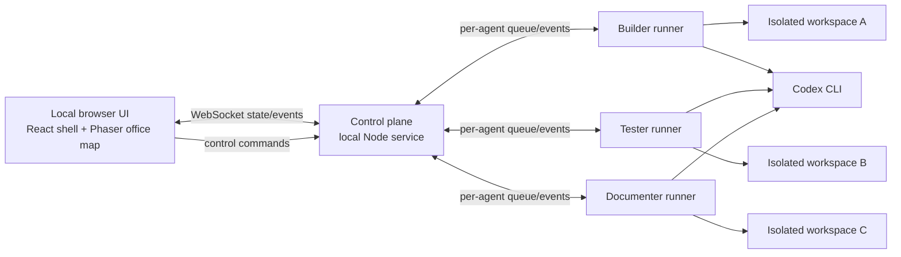

# Agentville MVP Design

## Goal

Agentville is a local, visual mission-control app for a small team of coding agents. It proves that a user can see real coding work, understand an agent's state at a glance, and steer the work from a two-dimensional office map.

The MVP demo is intentionally local-first, single-user, and focused on three real coding agents. It prioritizes a credible control loop over visual polish or multi-agent collaboration.

## Success criteria

- A local browser displays three agents whose state reflects real coding work performed through the Codex CLI.
- Each agent works in a separate disposable copy of a seeded TypeScript demo project.
- The map updates an agent's position within two seconds of a state change.
- A user can pause, resume, stop, approve a blocked task, assign a new task, and add an instruction from the UI.
- The primary demo completes in under three minutes: working agents, one approval gate, pause/resume, task assignment, and a successful completion.
- Mock mode provides the same event contract and makes the app runnable without credentials. It must be visibly identified as mock mode.

## Scope boundaries

In scope:

- Local browser app with a Phaser-rendered office and HTML control UI.
- One local control-plane process, three isolated runners, and the Codex CLI adapter.
- Live event streaming, short task summaries, command status, log tail, changed-file list, and test outcome.
- Local SQLite persistence for current agents, tasks, commands, checkpoints, and logs.
- A deterministic approval gate that produces a `blocked` state in the primary demo.

Out of scope:

- Login, multi-user collaboration, cloud deployment, mobile layout, multiplayer physics, agent-to-agent chat, and command undo/redo.
- Concurrent edits to Agentville itself or to a shared demo workspace.
- Pixel-art asset generation as a dependency for the demo.

## System architecture



### Browser UI

The browser uses a full-screen office map with desk, coffee, lounge, and attention zones. Phaser renders the tilemap, agents, hit areas, status badges, and short position tweens. The surrounding React UI renders the inspector, controls, task form, notifications, and status legend.

Clicking an agent opens a right-side inspector containing its current task, checkpoint, generated or runner-provided progress summary, log tail, changed files, test outcome, and applicable controls. Clicking an empty desk opens the task-assignment form. A blocked or errored agent appears in the attention zone and produces a visible, non-blocking notification.

Initial artwork uses clear geometric/pixel-inspired shapes. Generated or sourced pixel art is optional polish and cannot be on the critical path.

### Control plane

The local service is the single source of truth. It persists current state to SQLite, accepts UI commands, assigns positions from state, and broadcasts a full snapshot on connection followed by small event updates.

Each agent has a FIFO command queue. Commands use unique IDs and advance through `pending`, `acknowledged`, then `done` or `failed`; replaying an already accepted ID returns its recorded result. The service serializes command execution per agent but allows different agents to work concurrently.

### Agent runners

Each runner owns exactly one disposable workspace made from a seeded TypeScript project. The initial team has these roles:

- Builder: implements a small, bounded feature.
- Tester: adds or repairs automated coverage.
- Documenter: updates developer-facing documentation.

The runner turns a task into real, bounded Codex CLI checkpoints: inspect, implement, test, and report. It captures CLI progress and process output as log events and records the diff summary and test result after each checkpoint.

The command semantics are cooperative and explicit:

- `pause` finishes or stops at the current safe boundary and prevents the next checkpoint from starting.
- `resume` starts the saved next checkpoint.
- `stop` cancels the active CLI child process when present and cancels remaining checkpoints.
- `add_instruction` appends context to the next checkpoint prompt.
- `assign_task` creates a subsequent task for an idle agent.
- `approve` resolves an approval gate and makes the next checkpoint eligible to run.

Agentville must not claim arbitrary mid-inference pausing. The user-facing language and README describe pause as checkpoint-boundary control.

### Real and mock adapters

The primary adapter launches the installed Codex CLI in a runner's workspace and converts its output into the common runner event contract. Before implementation, a local smoke test must validate the available CLI invocation and structured-output behavior.

The mock adapter emits the same task, checkpoint, status, log, command, diff, and test events with deterministic timing. It exists for onboarding, automated tests, and demo resilience when Codex credentials or connectivity are unavailable. The UI clearly labels mock mode.

## State and movement model

```ts
type AgentStatus = "working" | "idle" | "blocked" | "error" | "paused" | "stopped";
type Zone = "desk" | "coffee" | "lounge" | "attention";
type CommandType = "approve" | "pause" | "resume" | "stop" | "assign_task" | "add_instruction";

interface Agent {
  id: string;
  name: string;
  role: "builder" | "tester" | "documenter";
  status: AgentStatus;
  currentTaskId?: string;
  checkpoint?: "inspect" | "implement" | "test" | "report";
  zone: Zone;
  position: { x: number; y: number };
  lastUpdated: string;
}

interface Task {
  id: string;
  agentId: string;
  title: string;
  instructions: string[];
  status: "queued" | "running" | "blocked" | "completed" | "failed" | "cancelled";
  summary?: string;
  blockedReason?: string;
  changedFiles: string[];
  testResult?: "passed" | "failed" | "not_run";
}

interface Command {
  id: string;
  agentId: string;
  type: CommandType;
  payload?: { taskTitle?: string; instruction?: string };
  status: "pending" | "acknowledged" | "done" | "failed";
  createdAt: string;
}
```

Placement is deterministic. Working agents use unoccupied desk slots. Paused agents retain their desk slot and show a pause badge. Idle agents alternate between available lounge and coffee slots. Blocked and errored agents move to attention slots. If task grouping is added later, grouped working agents receive adjacent desk slots; it is not required for the first demo.

## Demo scenario

1. Launch the local app with the three agents already executing bounded tasks.
2. Builder reaches a planned approval gate and moves to the attention zone.
3. The user pauses Tester, verifies the paused state, then resumes it.
4. The user approves Builder; its real next coding checkpoint proceeds.
5. The user assigns Documenter a follow-up task from an empty desk.
6. The inspector shows task progress, changed files, and the passing test result for a completed task.

The approval gate is part of the task workflow, not a fabricated output stream: the real Codex work continues only after approval.

## Errors and recovery

- Missing Codex executable, authentication, or API connectivity creates an `error` state with an actionable explanation and the option to restart in mock mode.
- Child-process failure records its exit result, marks the active task failed, and preserves logs for inspection.
- A failed control command is shown in the inspector; a command is never silently dropped.
- Runner restart restores persisted state. Any previously active task becomes `paused` until explicitly resumed, preventing accidental duplicate execution.
- The UI handles reconnect by requesting a fresh snapshot, then resumes incremental updates.

## Verification

- Unit tests cover the agent state machine, safe status transitions, idempotent commands, FIFO queues, and zone/slot assignment.
- Integration tests run the mock adapter through assignment, pause, resume, approval, stop, failure, reconnection, and completion.
- A manual real-Codex smoke test verifies task start, safe-boundary pause, resume, approval, filesystem diff, and test result within an isolated workspace.
- A demo rehearsal verifies that the complete scenario completes in under three minutes and works in mock mode with no API key.

## Acceptance checklist

- [ ] Three agents visibly perform or simulate the same event contract in isolated workspaces.
- [ ] Every requested command has visible lifecycle feedback.
- [ ] At least one genuine Codex task produces a changed-file list and a test outcome.
- [ ] The map reflects all state changes in less than two seconds.
- [ ] The approval, pause/resume, and assignment paths work end-to-end.
- [ ] Mock mode is runnable via the documented setup command.
